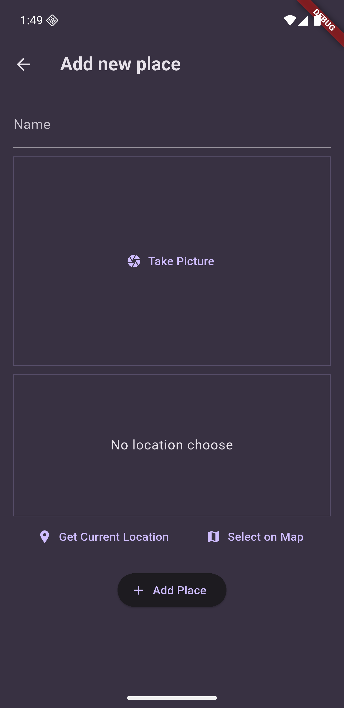
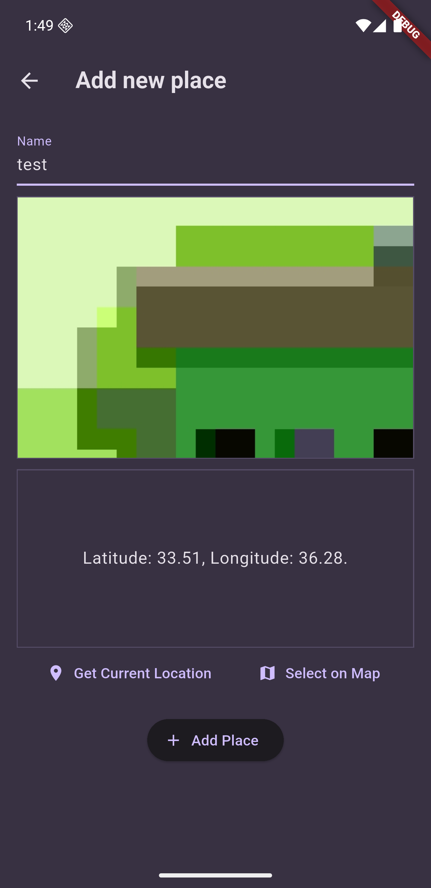
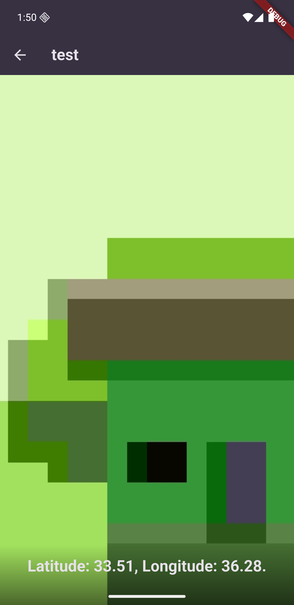

# favorite_places

An app where you can add your favorite places, take a photo of the place and capture place location. The app demonstraits the use of native features in Flutter such as using the device camera, storing files to the internal storage and presesting data using sqlite database.

## Screenshots

     